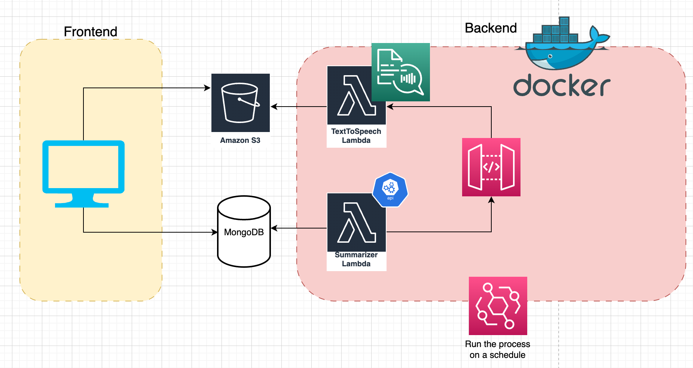

# Acta backend

[Acta](https://acta.fyi) is a newsletter powered by AI. Weekly, top articles for a subscribed topic are gathered from the internet. A model summarizes the article and another service reads the article text out loud.

OpenAI API is used for text summarization and AWS polly is used for text to speech synthesis.

Pulumi (IaaC) is used to manage AWS services. Backend services include, AWS lambda, AWS Polly, AWS S3, AWS API gateway and AWS ECR. All the code is containerized in Docker and executed using lambdas.

Architecture diagram for the entire system is below.

